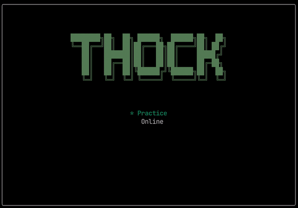

# thock

 [](https://hackage.haskell.org/package/thock)



## Installation

### Binary

Right now there are only binaries for Ubuntu and macOS under [releases](https://github.com/rmehri01/thock/releases). Unfortunately there is no support for Windows but the Ubuntu binary will still work in [WSL](https://docs.microsoft.com/en-us/windows/wsl/about).

To use the binary you will have to put it on your PATH and may have to change permissions using `chmod` or allowing it in system preferences.

### From Source

```console
git clone https://github.com/rmehri01/thock.git
cd thock
stack install thock
```

## Usage
 | English/Haskell | Russian | Description | Game State
 | - | - | - | -
 | `Esc`        | `Esc`        | go back | Any
 | `^r`         | `^к`         | retry | Practice
 | `^n / Enter` | `^т / Enter` | next quote | Practice
 | `r`          | `к`          | signal your readiness | Online game waiting room

## Credit

The terminal UI is made using the amazing [brick](https://github.com/jtdaugherty/brick/) library and the online functionality was done using [websockets](https://github.com/jaspervdj/websockets). I also took a great amount of inspiration from other great projects such as [hascard](https://github.com/Yvee1/hascard), [monkeytype](https://github.com/Miodec/monkeytype), and [gotta-go-fast](https://github.com/callum-oakley/gotta-go-fast).
